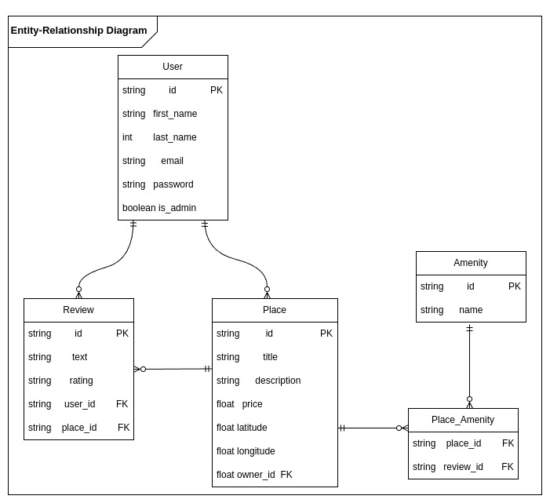

# **HBNB API - v1**

## **Description**
HBNB API is a RESTful API built using Flask and Flask-RESTx for the HBNB project. It provides endpoints to manage users, places, amenities, and reviews.

This project is part of the Holberton School curriculum.

---

## **Features**
The HBNB API provides the following functionalities:

- **Users Management**
  - Create, retrieve, update, and delete users.

- **Places Management**
  - Create, retrieve, update, and delete places.
  - Associate places with amenities.
  - Retrieve reviews for places.

- **Amenities Management**
  - Create, retrieve, update, and delete amenities.

- **Reviews Management**
  - Create, retrieve, update, and delete reviews for places.

---

## **How It Works**
1. The API is structured using Flask-RESTx.
2. Blueprints are used to organize endpoints (`/api/v1` prefix).
3. Each resource (Users, Places, Amenities, Reviews) has its own namespace.
4. A facade layer (`HBnBFacade`) handles business logic.
5. Uses models for request validation.

---

## **File Descriptions**

### **app/api/v1/__init__.py**
- Initializes the API.
- Registers namespaces for users, places, amenities, and reviews.

### **app/api/v1/amenities.py**
- Endpoints for managing amenities:
  - `POST /api/v1/amenities/` - Create a new amenity.
  - `GET /api/v1/amenities/` - Retrieve all amenities.
  - `GET /api/v1/amenities/<amenity_id>` - Retrieve a specific amenity.
  - `PUT /api/v1/amenities/<amenity_id>` - Update an amenity.

### **app/api/v1/places.py**
- Endpoints for managing places:
  - `POST /api/v1/places/` - Create a new place.
  - `GET /api/v1/places/` - Retrieve all places.
  - `GET /api/v1/places/<place_id>` - Retrieve a specific place.
  - `PUT /api/v1/places/<place_id>` - Update a place.
  - `GET /api/v1/places/<place_id>/reviews` - Get all reviews for a place.

### **app/api/v1/reviews.py**
- Endpoints for managing reviews:
  - `POST /api/v1/reviews/` - Create a new review.
  - `GET /api/v1/reviews/` - Retrieve all reviews.
  - `GET /api/v1/reviews/<review_id>` - Retrieve a specific review.
  - `PUT /api/v1/reviews/<review_id>` - Update a review.

---

## **Requirements**
- **Operating System**: Linux, macOS or Windows
- **Programming Language**: Python3
- **Framework**: Flask, Flask-RESTx

---

## **Installation and Usage**
 - pip install Flask Flask-RESTx
 - pip install -r requirements.txt

 ---

### **Clone the repository**
```bash
git clone https://github.com/wwalid18/holbertonschool-hbnb.git
cd part2/Hbnb
python3 run.py

```
 --- 

### **Authors**
 - Nour Kasmi https://github.com/Nourkasmi
 - Walid Chaouachi https://github.com/wwalid18

 ### **Entity-Relationship Diagram**
